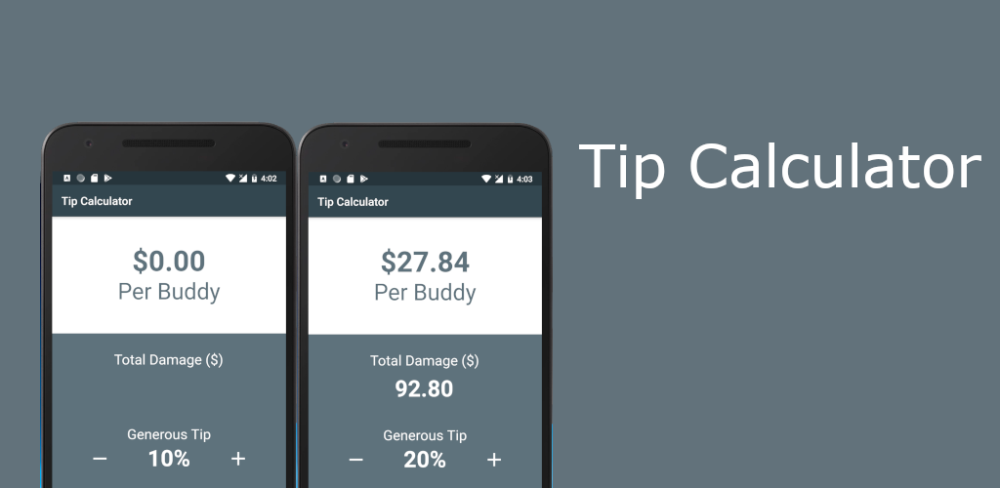

# Tip Calculator

Evenly split a bill between friends, including the tip.

## Getting Started

This is a Flutter implementation from the article published by 
[Lawrence Tan](https://medium.com/@lawrey/android-kotlin-tutorial-build-your-own-tip-calculator-95ae98ac83d3).
This application has been tested on both Android and iOS phone devices.

  
## Play Store

Tip Calculator is available for install from the 
[Play Store](https://play.google.com/store/apps/details?id=ca.venasse.tip_calculator&rdid=ca.venasse.tip_calculator).  
This listing is 100% free and does not contain any ads.
